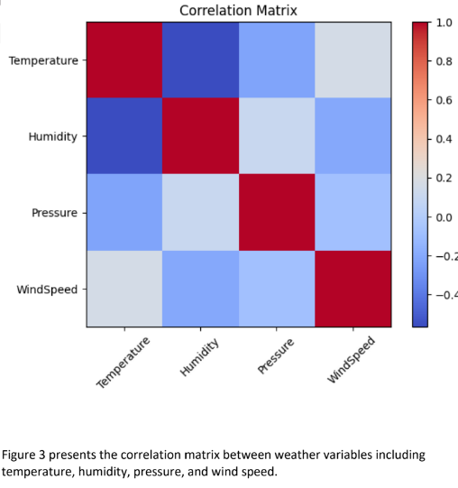

# 🌤️ Weather Data Analytics and Temperature Prediction

Machine Learning project for analyzing historical weather data and predicting temperature using regression models. The project applies data preprocessing, exploratory data analysis (EDA), feature engineering, and model evaluation to identify weather patterns and improve prediction accuracy.

---

# 📖 About the Project

This project focuses on analyzing historical weather data collected from multiple cities and building machine learning models capable of predicting temperature using weather-related attributes.

The project follows the complete data mining workflow, including data preprocessing, visualization, feature correlation analysis, model training, and performance evaluation.

Two regression models were implemented and compared:

* Linear Regression
* Random Forest Regressor

The results demonstrate that Random Forest provides better prediction performance than Linear Regression.

---

# ✨ Features

| Feature                      | Description                                    |
| ---------------------------- | ---------------------------------------------- |
| 📥 Data Collection           | Historical weather dataset from Kaggle         |
| 🧹 Data Preprocessing        | Cleaning missing values and preparing data     |
| 📊 Exploratory Data Analysis | Statistical analysis and visualization         |
| 📈 Weather Trend Analysis    | Daily temperature trend visualization          |
| 🔗 Correlation Analysis      | Relationship between weather variables         |
| 🤖 Machine Learning          | Temperature prediction using regression models |
| 📉 Model Evaluation          | MAE, RMSE and R² comparison                    |

---

# 📊 Dataset

**Historical Hourly Weather Data**

Source:

https://www.kaggle.com/datasets/selfishgene/historical-hourly-weather-data

Dataset includes:

* Temperature
* Humidity
* Pressure
* Wind Speed
* Multiple Cities
* Historical Hourly Records

---

# 📸 Project Results

## Daily Temperature Trend


---

## Pressure vs Temperature


---

## Correlation Matrix



---

## Actual vs Predicted Temperature (Random Forest)


---

# 📈 Model Performance

| Model             |  MAE | RMSE | R² Score |
| ----------------- | ---: | ---: | -------: |
| Linear Regression | 6.64 | 7.89 |     0.33 |
| Random Forest     | 4.62 | 5.97 |     0.62 |

Random Forest achieved lower prediction errors and a higher R² score, making it the best-performing model in this project.

---

# 🔄 Project Workflow

```text
Historical Weather Dataset
            │
            ▼
     Data Preprocessing
            │
            ▼
 Exploratory Data Analysis
            │
            ▼
 Correlation Analysis
            │
            ▼
 Feature Selection
            │
            ▼
 Machine Learning Models
      │               │
      ▼               ▼
Linear Regression   Random Forest
      │               │
      └───────┬───────┘
              ▼
      Performance Evaluation
              │
              ▼
 Temperature Prediction
```

---

# 🛠️ Technologies & Tools

* Python
* Pandas
* NumPy
* Matplotlib
* Scikit-learn
* Jupyter Notebook
* Kaggle
* GitHub

---

# 📁 Project Structure

```text
Weather-Temperature-Prediction/
│
├── weather_temperature_prediction.ipynb
├── README.md
├── requirements.txt
│
├── images/
│   ├── temperature_trend.png
│   ├── pressure_vs_temperature.png
│   ├── correlation_matrix.png
│   └── random_forest_prediction.png
│
└── data/
```

---

# 👨‍💻 Team

* Talal Ahmed Salem
* Omar Bahitham
* Ali Aqeel
* Nasser Banjar

---

# 🎓 Course

Big Data Mining

College of Computing

Umm Al-Qura University

---

# 📄 License

This project was developed for educational purposes as part of the Data Mining course at Umm Al-Qura University.
